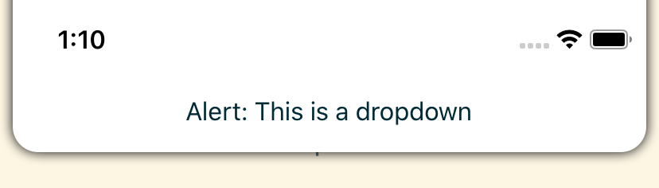

# AirshipDropdown

The dropdown component slides in from the top of the screen. It can have any contents you like, but it is most useful for alerts.



The dropdown accepts a `bridge` property, which allows it to animate away & remove itself once the `Airship.show` promise resolves.

The dropdown auto-hides itself after a short timeout, or whenever the user taps on it. You can pass an `onPress` callback to change the tap behavior, and you can use the `autoHideMs` prop to change the timeout (or disable it).

## Reference

Here are the properties the component accepts. Only the `bridge` property is mandatory.

```typescript
export interface AirshipDropdownProps {
  bridge: AirshipBridge<undefined>
  children?: React.ReactNode

  // Called when the user taps anywhere in the dropdown.
  // Defaults to hiding the dropdown.
  onPress?: () => void

  // Determines how long the dropdown remains visible,
  // or 0 to disable auto-hide. Defaults to 5000ms.
  autoHideMs?: number

  // The component color. Defaults to white.
  backgroundColor?: string

  // The radius to use on the bottom corners. Defaults to 4.
  borderRadius?: number

  // The flex direction for the contents.
  flexDirection?: ViewStyle['flexDirection']

  // How to justify the contents along the flex direction.
  justifyContent?: ViewStyle['justifyContent']

  // The minimum gap between the component and the screen edges.
  // Takes 0-4 numbers (top, right, bottom, left),
  // using the same logic as the web `margin` property. Defaults to 0.
  margin?: number | number[]

  // The maximum height the component will be.
  // Defaults to 25% of the longest screen dimension.
  maxHeight?: number

  // The maximum width the component will be.
  // Defaults to 512.
  maxWidth?: number

  // Internal padding to place inside the component.
  // Takes 0-4 numbers (top, right, bottom, left),
  // using the same logic as the web `padding` property. Defaults to 0.
  padding?: number | number[]

  // How long the entry animation should be. Defaults to 300ms.
  slideInMs?: number

  // How long the exit animation should be. Defaults to 500ms.
  slideOutMs?: number
}
```
