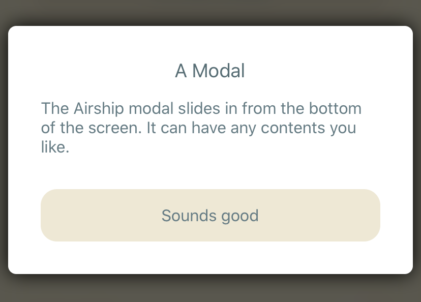

# AirshipModal

The modal component slides up from the bottom of the screen, while the rest of the app dims. Tapping outside the modal dismisses it. The modal can have any contents you like.



The modal accepts a `bridge` property, which allows it to animate away & remove itself once the `Airship.show` promise resolves.

The modal also requires an `onCancel` callback. The modal calls this whenever the user taps outside the modal or presses the phone's back button. The best approach is to call `bridge.resolve` or `bridge.reject` to dismiss the modal when this happens. If you don't want the user to easily escape the modal, just pass a do-nothing function to `onCancel`.

The best way to use `AirshipModal` is to treat it as a building block for a larger modal component, which includes your various messages, buttons, or controls:

```javascript
export function YesNoModal(props) {
  const { bridge, question } = props

  return (
    <AirshipModal bridge={bridge} onCancel={() => bridge.resolve(false)}>
      <Text>{question}</Text>
      <Button onPress={() => bridge.resolve(true)} title="Yes" />
      <Button onPress={() => bridge.resolve(false)} title="No" />
    </AirshipModal>
  )
}
```

Now you can pass this larger `YesNoModal` to the `Airship.show` method to get a quick boolean answer:

```javascript
const answer = await Airship.show(bridge => (
  <YesNoModal bridge={bridge} question="Do you like questions?" />
))
```

Although this example lacks pretty styling, it is completely functional. See [AirshipDemo/src/TextInputModal.tsx](../AirshipDemo/src/TextInputModal.tsx) for a text input modal with theming.

## Reference

Here are the properties the component accepts. Only the `bridge` and `onCancel` properties are mandatory.

```typescript
export interface AirshipModalProps<T = unknown> {
  bridge: AirshipBridge<T>
  children?: React.ReactNode

  // Called when the user taps outside the modal or clicks the back button:
  onCancel: () => void

  // True to have the modal float in the center of the screen,
  // or false for a bottom modal. Defaults to false.
  center?: boolean

  // The component color. Defaults to white.
  backgroundColor?: string

  // The radius to use on the corners. Defaults to 10.
  borderRadius?: number

  // The color to use for the border. Defaults to undefined.
  borderColor?: string

  // Width (better known as thickness) of the border. Default to 0
  borderWidth?: number

  // The flex direction for the contents.
  flexDirection?: ViewStyle['flexDirection']

  // How to justify the contents along the flex direction.
  justifyContent?: ViewStyle['justifyContent']

  // The minimum gap between the component and the screen edges.
  // Takes 0-4 numbers (top, right, bottom, left),
  // using the same logic as the web `margin` property. Defaults to 0.
  margin?: number | number[]

  // The maximum height the component will be.
  // Defaults to no limit.
  maxHeight?: number

  // The maximum width the component will be.
  // Defaults to 512.
  maxWidth?: number

  // Behavior for components that overflow the modal.
  // Defaults to 'visible'.
  overflow?: 'visible' | 'scroll' | 'hidden'

  // Internal padding to place inside the component.
  // Takes 0-4 numbers (top, right, bottom, left),
  // using the same logic as the web `padding` property. Defaults to 0.
  padding?: number | number[]

  // The offset for the drop shadow on iOS. Defaults to 0.
  shadowOffset?: { height: number; width: number }

  // The opacity of the drop shadow on iOS. Defaults to 1.
  shadowOpacity?: number

  // The blur radius of the drop shadow on iOS. Defaults to 10.
  shadowRadius?: number

  // How long the entry animation should be. Defaults to 300ms.
  slideInMs?: number

  // How long the exit animation should be. Defaults to 300ms.
  slideOutMs?: number

  // The color of the window underlay,
  // or a React element for a custom background.
  // Defaults to rgba(0, 0, 0, 0.75).
  underlay?: string | React.ReactElement
}
```
